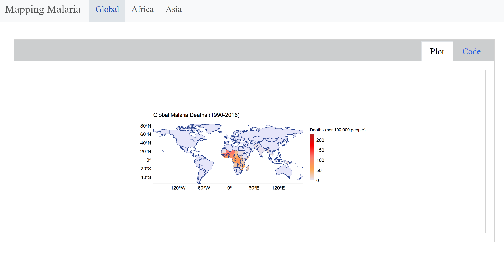

## Mapping Malaria Deaths (1990–2016)

An **interactive dashboard** visualizing **global**, **African**, and **Asian** malaria death rates over time using geospatial data and animated maps.
Built with **R** and **Quarto**, the dashboard uses custom themes and color gradients to highlight mortality patterns.

### **Live** [Dashboard](https://darakhshannehal.quarto.pub/malaria/#global)

### [Full Analysis](index.qmd)

### Packages Used

- **tidyverse**: Data wrangling and transformation
- **sf**: Handling and plotting spatial geometries 
- **rnaturalearth**: Accessing world map shapefiles
- **gganimate**: Creating animated visualizations over time
- **transformr**: Enabling smooth transitions in animations
- **magick**: Rendering and saving animations as high-quality GIFs
- **ggtext**: Supporting markdown formatting in plot titles and labels

### Data: Our World in Data via [TidyTuesday (2018-11-13)](https://github.com/rfordatascience/tidytuesday/tree/master/data/2018/2018-11-13)
